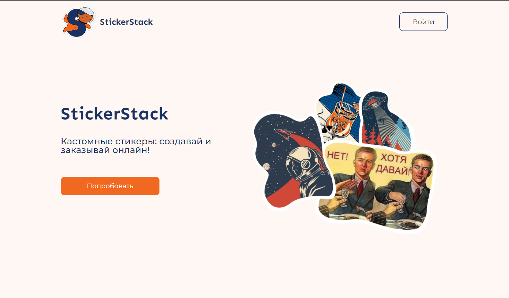
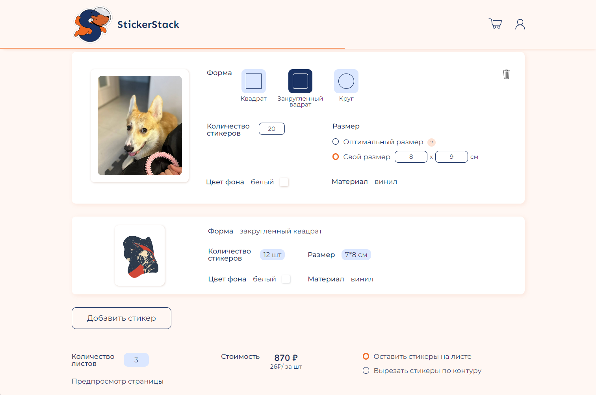
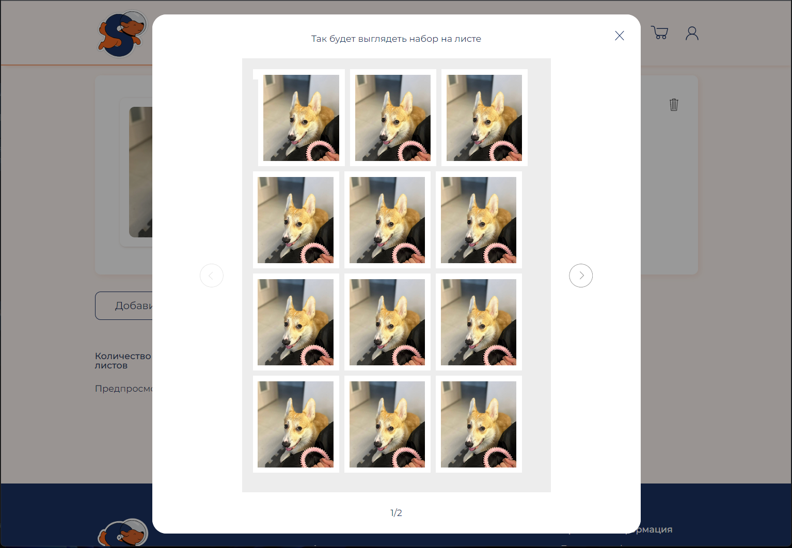
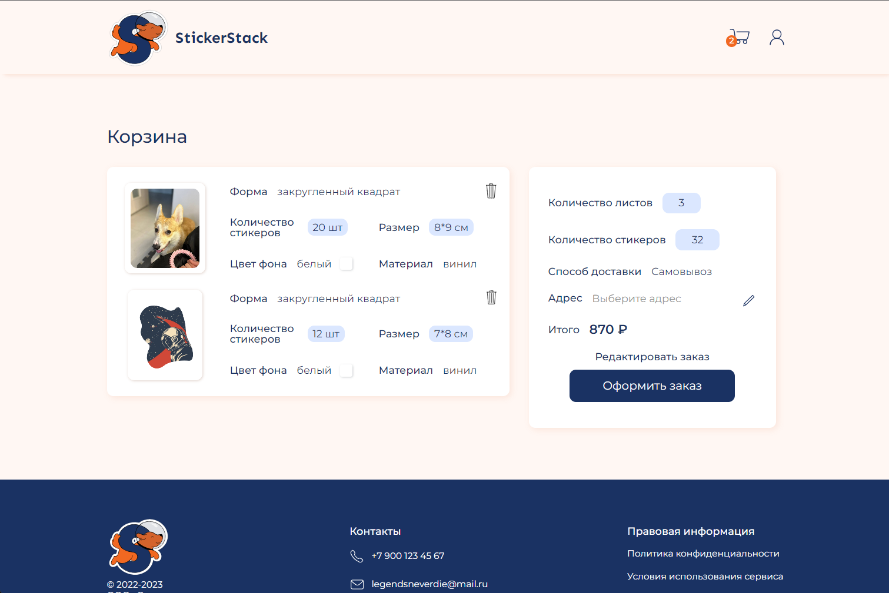
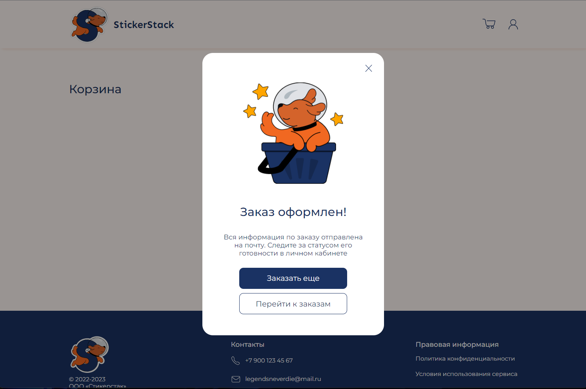
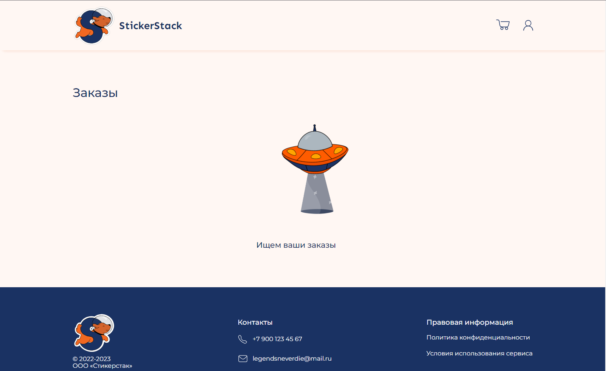
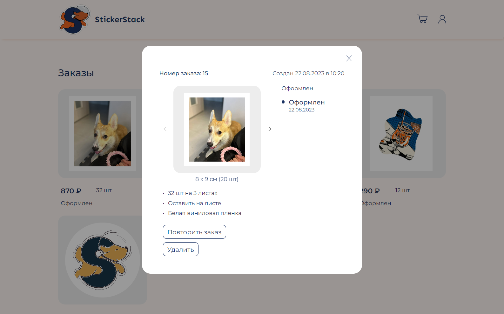
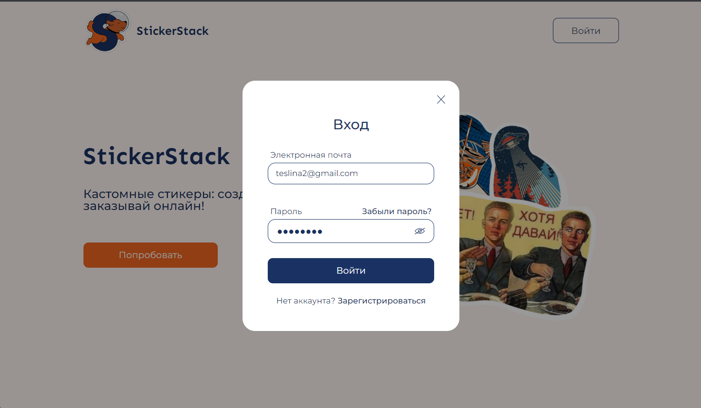
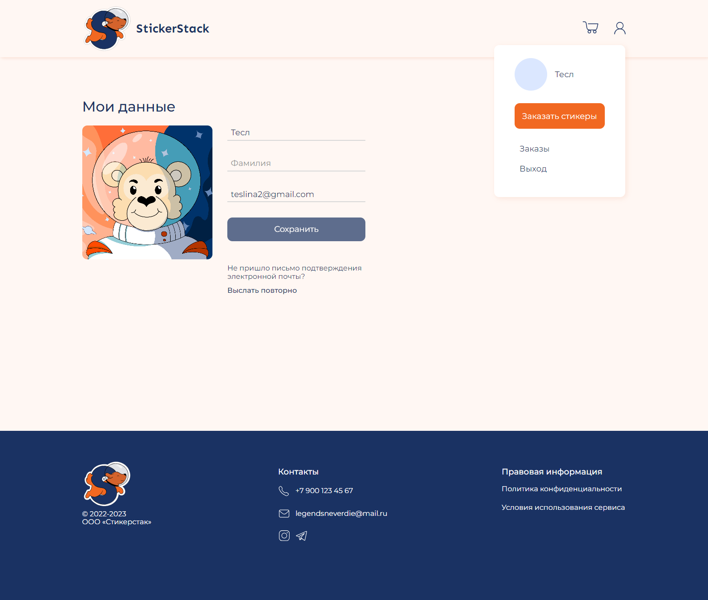

## StickerStack

---

### 🌐 Ссылки

- [Сайт StickerStack](https://stickerstack.ru/)
- [Репозиторий backend](https://github.com/StickerStack/backend) части проекта
- [Макет проекта в Figma](https://www.figma.com/file/Z1qiU1QZYnQjvKMplUsRkj/PoC?node-id=0%3A1)

---

### ⏱ Описание

Frontend часть сайта для создания кастомных стикеров с мгновенным просмотром их расположения на листах. В финальной версии продукта
пользователь сможет совершать покупки, после чего придет посылка с виниловыми стикерами с матовой или глянцевой ламинацией.

_Главная страница_

### Основные фичи

- Создание стикеров

Масимально автоматизировано. Пользователь загружает свои изображения, выбирает размер и форму стикеров, а программа приводит их к нужному формату, добавляет белую обводку и размещает на листах. Можно просматривать, как стикеры расположились на листах, и редактировать для достижения желаемого результата.
В зависимости от количества листов подсчитывается стоимость заказа. Также есть возможность выбрать, в каком виде получать стикеры - готовые вырезанные по контуру или стикерпак на листе.

Весь процесс динамический. Это означает, что подсчеты и размещение картинок на листах происходят автоматически, когда пользователь меняет какие-то параметры своих стикеров.

- Оформление и просмотр заказов

Когда корзина заполнена и пользователь готов совершить заказ, происходит оформление. Массив стикеров компануется в заказ и отправляется в базу под уникальным номером.

На странице заказов отображается полная история заказов пользователя. Для каждого заказа можно открыть подробную информацию - о дате, статусах, загруженных картинках.

- Аутентификация и личный кабинет

Новому пользователю необходимо пройти несколько этапов, чтобы получить доступ к основному функционалу сайта - зарегистрироваться с электронной почтой и паролем, авторизироваться. Для оформления заказа потребуется подтвердить почту: при регистрации на указанный адрес приходит письмо со ссылкой для подтверждения.
Через письмо на почту также реализован процесс восстановления и смены пароля.

После регистрации у пользователя появляется личный кабинет. Там можно редактировать аватарку и информацию о себе. После редактирования поля с почтой та снова считается неподтвержденной и требует подтверждения. Письмо подтверждения можно дополнительно запросить из личного кабинета.

---

  
  
 <h3>💪 Функционал</h3> 

    <ul>
      <li>Регистрация и авторизация с использованием Redux</li>
      <li>Аутентификации пользователя на основании данных от backend</li>  
      <li>Подтверждение почты и восстановление пароля через тригерные письма</li>
      <li>Просмотр и редактирование личного кабинета по полям имя, фамилия, почта и аватар</li> 
      <li>Загрузка картинок и последующее оформление стикеров на листах с помощью Redux и средств разметки</li>
      <li>Оформление и просмотр заказов</li>
т </ul>

---

  
  
 <h3>📈 Планы по развитию проекта</h3> 

    <ul>
     <li>Реализовать хранение загруженных стикеров и корзины на backend</li>
     <li>Выполнить адаптацию сайта к различным размерам экранов, в том числе мобильную версию</li>
      <li>Настроить оплату заказов</li>
    </ul>

---

### 🔧 Стек технологий

_React, React Hook Form, Redux-toolkit, TypeScript, Html, SASS, Git_

  

---

### 🚀 Инструкция по запуску на локальной машине

- Установить [Node.js](https://nodejs.org/ru/)
- Клонировать репозиторий ` git clone git@github.com:StickerStack/StickerStack_frontend.git`
- Установить зависимости `npm install`
- Запустить приложение `npm run start`
