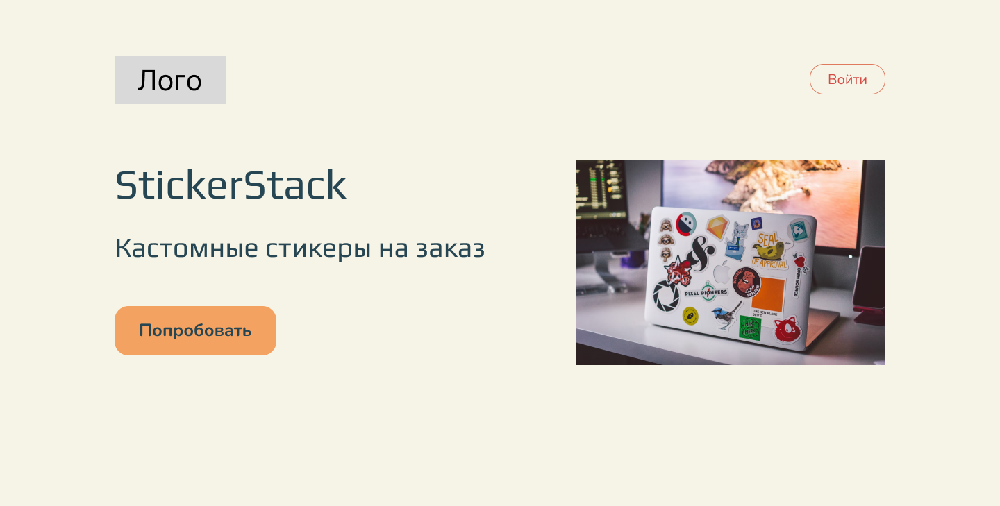

## StickerStack

___

### 🌐 Ссылки на проект:

* [https://postcard-eight-march-for-mom.vercel.app/](https://postcard-eight-march-for-mom.vercel.app/) - front-end часть
  на временном хостинге
* [https://github.com/StickerStack/backend](https://github.com/StickerStack/backend) - репозиторий back-end части
* [Макет проекта в Figma](https://www.figma.com/file/Z1qiU1QZYnQjvKMplUsRkj/PoC?node-id=0%3A1)

___

### ⏱ Описание проекта:

Проект представляет из себя сайт для распечатки и продажи кастомных стикеров.
Пользователь загружает картинки, выбирает размер стикеров, количество стикер-паков и оплачивает заказ.
После покупки пользователь получит бандероль с виниловыми стикерами с матовой или глянцевой ламинацией, аккуратно 
вырезанные по контуру. 


*Главная страница*

У пользователя есть личный кабинет, где отображаются данные о пользователе и история заказов.
Перед просмотром личного кабинета или оформления заказа необходимо зарегистрироваться или авторизироваться 
через специальную форму.


*Пример стикерпака*

В проекте имется front-end и back-end части. Из back-end части на front-end приходят данные для авторизации 
пользователя (cookie), информация о пользователе и его история заказов.

___
<details>  <summary> <h3>Структура React Components и Redux</h3> </summary>


</details>

___

### 🔧 Стек технологий:

*Html, CSS, SASS, Git, JavaScript, React, React Hook Form, Redux-toolkit, TypeScript*


  


  

___

### 🚀 Инструкция по запуску на локальной машине:
* Установить [Node.js](https://nodejs.org/ru/)
* Клонировать репозиторий ``` git clone git@github.com:StickerStack/StickerStack_frontend.git```
* Установить зависимости ``` npm install ```
* Запустить приложение ``` npm run start ```
